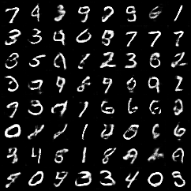
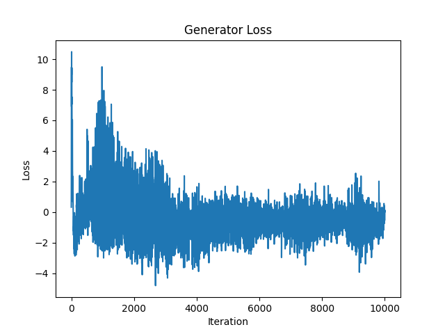
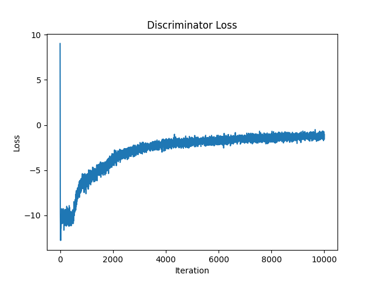
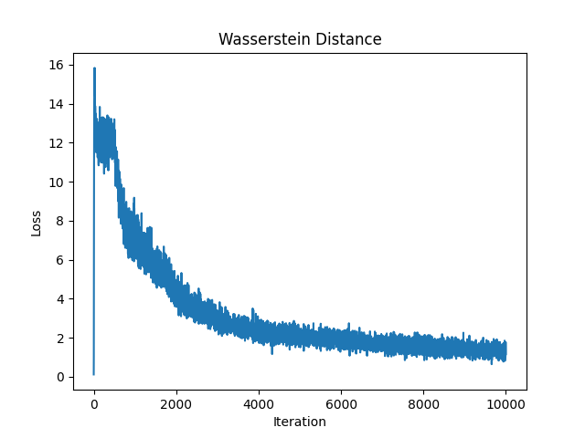
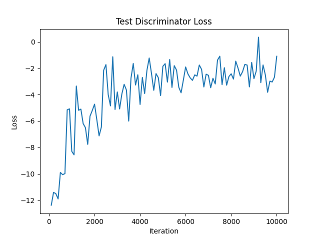

# WGAN-GP-Pytorch

A PyTorch implementation of WGAN-GP ([Improved Training of Wasserstein GANs](https://arxiv.org/pdf/1704.00028.pdf)).

Official Repo with Tensorflow 1.x and Python 2: [improved_wgan_training](https://github.com/igul222/improved_wgan_training).

## Requirements

### Software
- Python3

### Packages
- Pytorch
- Torchvision
- imageio
- matplotlib
- argparse

## Commands

### Before training
```bash
git clone https://github.com/LuChang-CS/WGAN-GP-PyTorch.git
cd wgangp
```

The parameter configurations are in `config.py`. The default confs are for the MNIST dataset.

### MNIST
```bash
python run_train.py --dataset=mnist
```

### CIFAR10
```bash
python run_train.py --dataset=cifar10 --batch_size=64
```

## Results

The results folder will be automatically created at `./result/{dataset}`. The results include model parameters (`./result/{dataset}/params/`) and plots (`./result/{dataset}/figs/`).

### MNIST

10000 iterations.

- Transitions of generating from a fixed noise


- Samples at the 10000th iteration



- Generator Loss, Discriminator Loss, Wasserstein Distance





- Discriminator output on test data


